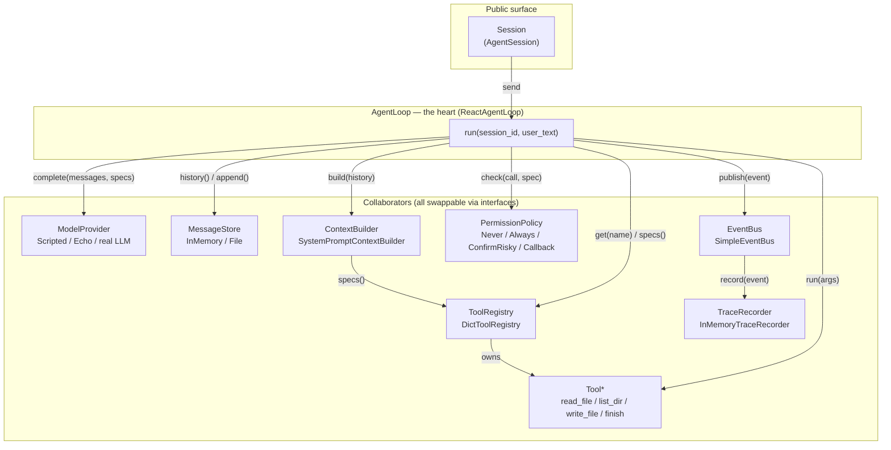
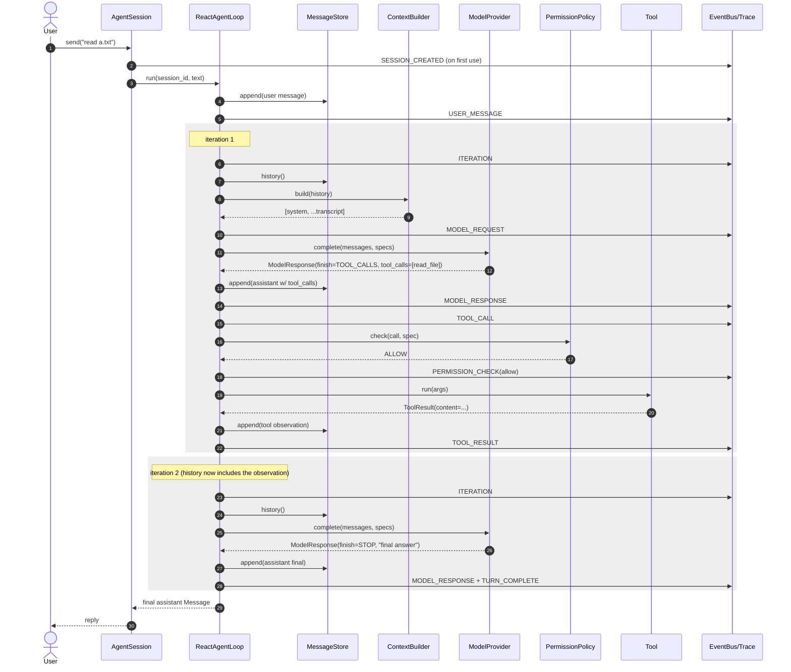

# agent_harness — a minimal educational coding-agent harness

A small, dependency-free Python harness that reproduces the **turn logic** of the
OpenHands agent, distilled from the architecture docs we wrote in
[`../docs/agent-turn-sequence.md`](../docs/agent-turn-sequence.md) and
[`../docs/core-module-map.md`](../docs/core-module-map.md).

It is designed for learning:

- **Ten small interfaces** (Protocols) name the ten responsibilities of an agent turn.
- **One readable loop** (`ReactAgentLoop`) wires them together and gets the OpenHands
  turn shape right: build context → one model call → detect tool calls → permission
  gate → execute → insert observation → re-read history → iterate → persist → emit events.
- **Runs with stock Python** (no pydantic, no network, no API key) using fake providers,
  so you can watch a full turn and its trace immediately.

> This is an independent reimplementation of the *flow*. It does **not** copy OpenHands
> source or reproduce its implementation. Where OpenHands runs the model/tools in an
> external agent-server over HTTP, this harness runs them in-process to stay readable.

---

## Quick start

```bash
cd openhands_all/agent_harness

# Scripted end-to-end demo: tool-call -> observation -> final answer, with a full trace.
python -m harness

# Interactive REPL (rule-based EchoModelProvider; try: "read README.md").
python -m harness --repl

# Tests (uses pytest; falls back cleanly if not installed).
python -m pytest tests -q
```

Programmatic use:

```python
from harness.impl import build_default_harness

harness = build_default_harness(workspace=".")
session = harness.new_session()
reply = session.send("read README.md")
print(reply.content)
for event in harness.trace.export(session.id):
    print(event.kind.value, event.payload)
```

---

## 1. Component diagram

The ten interfaces and how the loop orchestrates them. Each interface has a
reference implementation in `harness/impl` (or `harness/tools`).



**Mapping to OpenHands** (see `../docs/core-module-map.md`):

| This harness | OpenHands analogue |
|---|---|
| `Session` / `AgentSession` | conversation creation (`LiveStatusAppConversationService`) |
| `AgentLoop` / `ReactAgentLoop` | the agent loop **[EXTERNAL agent-server]** |
| `ModelProvider` | SDK `LLM` (`_configure_llm`, `stream=True`) |
| `ContextBuilder` | system-prompt construction + skill/instruction loading |
| `Tool` / `ToolRegistry` | `openhands.tools` (`get_default_tools`) |
| `PermissionPolicy` | confirmation policy + security analyzer (`_select_confirmation_policy`) |
| `MessageStore` | event/transcript persistence (`EventService.save_event`) |
| `EventBus` | event webhook + callbacks (`webhook_router.on_event`) |
| `TraceRecorder` | event persistence + trajectory export (`iter_events_for_export`) |

---

## 2. Event flow

One turn produces an ordered stream of events (published on the `EventBus`,
recorded by the `TraceRecorder`). This is the sequence for a turn that makes one
tool call and then answers:



Event kinds emitted (see `harness/types.py::EventKind`):
`session_created`, `user_message`, `iteration`, `model_request`, `model_response`,
`tool_call`, `permission_check`, `tool_result`, `turn_complete`, `error`.

The loop's terminal conditions:
- **`finish_reason != TOOL_CALLS`** → final answer (`TURN_COMPLETE`).
- **`max_iterations` reached** → runaway guard emits `ERROR` then `TURN_COMPLETE`.
- **tool failure / denial / unknown tool** → becomes an error *observation*, never a crash.

---

## 3. Working agent code — the loop that gets the logic right

The full loop lives in [`harness/impl/loop.py`](harness/impl/loop.py). Its core is
small enough to read in one sitting; this is the essence:

```python
def run(self, session_id: str, user_text: str) -> Message:
    self.store.append(session_id, Message(role="user", content=user_text))   # Step 1
    self._emit(session_id, EventKind.USER_MESSAGE, {...})

    for iteration in range(1, self.max_iterations + 1):                       # loop guard
        history  = self.store.history(session_id)                            # store = source of truth
        messages = self.context_builder.build(session_id, history)           # Steps 3-4 (system prompt)
        specs    = self.registry.specs()

        response = self.model.complete(messages, specs)                      # Step 5: ONE model call
        assistant = response.message
        self.store.append(session_id, assistant)

        if response.finish_reason != FinishReason.TOOL_CALLS or not assistant.tool_calls:
            return assistant                                                  # Step 11: final answer

        for call in assistant.tool_calls:                                     # Step 6: detect
            tool = self.registry.get(call.name)
            if tool is None:
                self._insert_observation(session_id, ToolResult(call.id, "Unknown tool", is_error=True))
                continue
            if self.permissions.check(call, tool.spec) != Decision.ALLOW:     # permission gate
                self._insert_observation(session_id, ToolResult(call.id, "denied", is_error=True))
                continue
            result = tool.run({**call.arguments, "__call_id__": call.id})     # execute
            self._insert_observation(session_id, result)                      # result insertion
        # iterate: observations are now in history -> model goes again
```

**Why it matches OpenHands** (from `../docs/agent-turn-sequence.md`):
- **exactly one model call per iteration** (Step 5);
- **history re-read every iteration** — the store is authoritative (Step 2/8 invariant);
- **tool-call detection → permission → execution → observation insertion** in that
  order (Step 6);
- **events emitted at every step and persisted** (Steps 7-9);
- **a hard iteration cap** as the runaway-agent guard.

The only thing you swap to make this a *real* agent is `ModelProvider.complete`:
serialize `(messages, tools)` to your provider's wire format, call the API, and parse
the reply back into a `ModelResponse`. Everything else stays identical.

---

## 4. Minimal directory structure

```
agent_harness/
├── README.md                     # this file (diagrams, event flow, dev sequence)
├── harness/
│   ├── __init__.py
│   ├── __main__.py               # `python -m harness` demo + `--repl`
│   ├── types.py                  # Message, ToolCall, ToolResult, ToolSpec, Event, ...
│   ├── interfaces/               # the ten roles, as Protocols
│   │   ├── __init__.py
│   │   ├── model.py              # ModelProvider
│   │   ├── loop.py               # AgentLoop
│   │   ├── store.py              # MessageStore
│   │   ├── context.py            # ContextBuilder
│   │   ├── tool.py               # Tool, ToolRegistry
│   │   ├── permission.py         # PermissionPolicy, Decision
│   │   ├── events.py             # EventBus, Subscriber
│   │   ├── session.py            # Session
│   │   └── trace.py              # TraceRecorder
│   ├── impl/                     # reference implementations
│   │   ├── __init__.py
│   │   ├── loop.py               # ReactAgentLoop  <-- the heart
│   │   ├── session.py            # AgentSession
│   │   ├── harness.py            # Harness + build_default_harness (composition root)
│   │   ├── store.py              # InMemoryMessageStore, FileMessageStore
│   │   ├── context.py            # SystemPromptContextBuilder
│   │   ├── registry.py           # DictToolRegistry
│   │   ├── permission.py         # NeverConfirm/AlwaysConfirm/ConfirmRisky/CallbackConfirm
│   │   ├── events.py             # SimpleEventBus
│   │   ├── trace.py              # InMemoryTraceRecorder
│   │   └── providers.py          # ScriptedModelProvider, EchoModelProvider
│   └── tools/
│       ├── __init__.py
│       └── builtin.py            # read_file, list_dir, write_file, finish
└── tests/
    └── test_harness.py           # loop behavior: persistence, tools, permissions, guards
```

---

## 5. Development sequence — simplest loop → production-ready

A suggested path. Each stage is runnable before you move on.

**Stage 0 — echo (no loop).** `Session.send` returns the model's reply for a single
call. Proves the `ModelProvider` + `MessageStore` boundary.

**Stage 1 — single-shot loop.** Add `AgentLoop` with **one** model call and a `STOP`
finish reason. No tools yet. (Tested by `test_simple_answer_no_tools`.)

**Stage 2 — tools + iteration.** Add `ToolRegistry`, `Tool`, and the
detect→execute→observe→re-iterate cycle. Terminate on non-`TOOL_CALLS`. Add the
`max_iterations` guard. (`test_tool_call_then_observation_then_answer`,
`test_max_iterations_guard`.)

**Stage 3 — context + system prompt.** Add `ContextBuilder` to render the system
prompt from the tool list and loaded instruction fragments ("skills"), plus a
history budget. (This is where OpenHands' skill/microagent loading would plug in.)

**Stage 4 — safety.** Add `PermissionPolicy`. Start with `NeverConfirm`, then
`ConfirmRisky` gating `spec.writes` tools; wire `CallbackConfirm` to an interactive
prompt. Confine tools to a workspace root. (`test_permission_denies_write`,
`test_permission_allows_risky_when_confirmed`.)

**Stage 5 — observability.** Add `EventBus` + `TraceRecorder`; emit an event at every
step; export the trajectory. This is your debugger and audit log.

**Stage 6 — durability.** Swap `InMemoryMessageStore` → `FileMessageStore` (or a DB).
Because the loop re-reads history from the store each iteration, a crash/restart
resumes cleanly. Persist the trace too.

**Stage 7 — real model + streaming.** Implement a real `ModelProvider.complete`
against OpenAI/Anthropic. Introduce streaming (yield partial assistant content and
tool-call deltas) — the interface stays the same; only the loop's persist points get
finer-grained.

**Stage 8 — production hardening (the OpenHands shape).** Move tool execution into a
**sandbox** (isolate the filesystem/network); make the loop **async** and the
`EventBus` an out-of-process transport (webhook/queue) so a control plane can persist
events and run callbacks (title generation, analytics) off the hot path — exactly the
`app_server` ↔ agent-server split documented in `../docs/`. Add condensation
(summarize old turns), retries/timeouts on the model call, per-tool permissions, and
multi-session concurrency.

---

## Design notes / non-goals

- **Sync, in-process, single-session** by default — deliberately, for readability.
  The async / sandboxed / multi-worker concerns are Stage 8, mapped to OpenHands but
  not implemented here.
- **No real provider bundled** — `ScriptedModelProvider` (deterministic, for tests
  and the demo) and `EchoModelProvider` (rule-based) keep the harness runnable with
  zero setup. Add a real provider by implementing one method.
- **Interfaces are `typing.Protocol`** so any object with the right methods works;
  there is no inheritance requirement.
