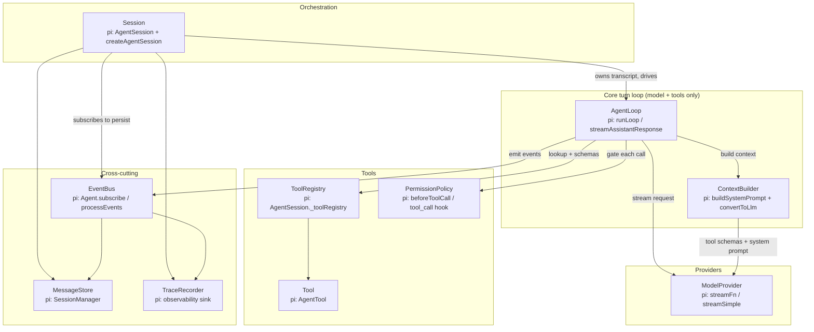

# agent_harness — a minimal coding-agent harness in Python

A from-scratch, dependency-free reimplementation of the **essential pi agent loop**,
distilled from [`pi/docs/agent-turn-sequence.md`](../docs/agent-turn-sequence.md) and
[`pi/docs/core-module-map.md`](../docs/core-module-map.md).

The goal is pedagogical: keep the **agent logic** that makes pi work and drop the
production surface (TUI, real providers, steering/follow-up queues, compaction,
extensions, packages) so the turn loop fits in your head. Every module names its
**pi origin** so you can jump back to the real implementation.

- Pure Python 3.10+, **stdlib only**. No install needed.
- Runs **offline** via a scripted mock model. An optional OpenAI-compatible provider
  is included (activates only when `OPENAI_API_KEY` is set).
- Fully working: `python examples/run_demo.py`, tests in `tests/`.

---

## Quick start

```bash
cd pi/agent_harness

# Run the offline end-to-end demo (scripted model, real file tools)
python examples/run_demo.py

# Run the tests (works with or without pytest)
python tests/test_agent_loop.py
# or: python -m pytest tests/ -q
```

---

## 1. Component diagram



**Layering (mirrors pi's split):**

- `AgentLoop` + `ModelProvider` + `Tool*` + `ContextBuilder` = **agent-core** (model &
  tool orchestration only; no persistence).
- `Session` = **AgentSession** (owns transcript, wires persistence + tracing as
  *event subscribers*, exactly like pi's `_handleAgentEvent`).
- Runtime dependency direction: `Session → AgentLoop → (ModelProvider, ToolRegistry,
  ContextBuilder)`. Persistence/trace never call back into the loop.

---

## 2. Event flow

The loop emits the same event vocabulary as pi's `AgentEvent`. Persistence and
tracing are pure listeners on the bus.

```mermaid
sequenceDiagram
    autonumber
    actor User
    participant Session
    participant Loop as AgentLoop
    participant Ctx as ContextBuilder
    participant Model as ModelProvider
    participant Perm as PermissionPolicy
    participant Tool
    participant Bus as EventBus
    participant Store as MessageStore
    participant Trace as TraceRecorder

    User->>Session: prompt("Summarize notes.txt")
    Session->>Loop: run([user_msg], history)
    Loop->>Bus: agent_start, turn_start
    Loop->>Bus: message_start/end (user)
    Bus-->>Store: append(user)
    Bus-->>Trace: record

    loop until assistant stops requesting tools (or max_iterations)
        Loop->>Ctx: build(history) -> LlmContext (system prompt + convert_to_llm + tool schemas)
        Loop->>Model: stream(context)
        Model-->>Loop: start, text_delta..., toolcall..., done
        Loop->>Bus: message_start / message_update* / message_end (assistant)
        Bus-->>Store: append(assistant)

        alt assistant requested tool calls
            Loop->>Loop: detect tool_calls (fail all if stop_reason == "length")
            Loop->>Perm: check(tool_call)
            alt denied
                Perm-->>Loop: {allow: false} -> error ToolResult
            else allowed
                Loop->>Loop: validate_arguments(tool, args)
                Loop->>Tool: execute(id, args, on_update)
                Tool-->>Loop: ToolResult (+ tool_execution_update)
            end
            Loop->>Bus: tool_execution_end + message_start/end (tool_result)
            Bus-->>Store: append(tool_result)
        end
        Loop->>Bus: turn_end
    end

    Loop->>Bus: agent_end
    Session-->>User: new messages (assistant final answer)
```

Real trace from `run_demo.py` (summarized): `agent_start → turn_start →
message(user) → message(assistant, tool_call read_file) → tool_execution_* →
message(tool_result) → turn_end → turn_start → message(assistant text) →
turn_end → agent_end`.

---

## 3. Working agent code

The whole thing runs. The core turn loop lives in
[`agent_harness/agent_loop.py`](agent_harness/agent_loop.py) and is a direct,
trimmed translation of pi's `runLoop`:

```python
while has_more:
    assistant = self._stream_assistant(history)     # pi: streamAssistantResponse
    history.append(assistant)
    if assistant.stop_reason in ("error", "aborted"):
        break
    results, has_more = [], False
    if assistant.has_tool_calls():
        batch = self._execute_tools(assistant, history)  # pi: executeToolCalls
        results, has_more = batch.results, not batch.terminate
        history.extend(results)
    self.bus.emit(Event(TURN_END, {...}))
```

Each tool call goes through **lookup → permission → validate → execute** (pi's
`prepareToolCall`/`executePreparedToolCall`):

```python
tool = self.registry.get(call.name)                  # missing -> error result
decision = self.permission.check(call)               # pi: beforeToolCall / tool_call hook
if not decision.allow: return ToolResult(is_error=True, content=decision.reason)
args = validate_arguments(tool, call.arguments)      # pi: validateToolArguments
return tool.execute(call.id, args, on_update)        # thrown errors -> error result
```

Minimal API:

```python
from agent_harness import Session, ScriptedModelProvider, PlannedResponse, tool_call, default_tools

model = ScriptedModelProvider(plan=[
    PlannedResponse(tool_calls=[tool_call("read_file", {"path": "notes.txt"})]),
    PlannedResponse(text="The file says ..."),
])
session = Session.create(model=model, cwd=".", tools=default_tools("."))
session.prompt("Summarize notes.txt")
```

To talk to a real model instead, swap the provider (needs `OPENAI_API_KEY`):

```python
from agent_harness import OpenAIChatProvider
session = Session.create(model=OpenAIChatProvider(model="gpt-4o-mini"), cwd=".")
```

### Interface ↔ pi origin map

| Interface | File | pi origin | Added vs pi | Subtracted vs pi |
|-----------|------|-----------|-------------|------------------|
| `ModelProvider` | `model_provider.py` | `streamFn` / `streamSimple` (sdk.ts, ai/compat.ts) | Scripted offline mock | Multi-provider registry, SSE/WS transport, thinking budgets, retries |
| `AgentLoop` | `agent_loop.py` | `runLoop` / `streamAssistantResponse` / `executeToolCalls` (agent-loop.ts) | `max_iterations` runaway guard | Parallel tools, steering/follow-up queues, `prepareNextTurn` |
| `MessageStore` | `message_store.py` | `SessionManager` (session-manager.ts) | — | Branching/`/tree`, compaction entries, model/thinking entries |
| `ContextBuilder` | `context_builder.py` | `buildSystemPrompt` + `convertToLlm` (system-prompt.ts, messages.ts) | `transform_messages` hook stub | Skills auto-load, prompt templates, image handling |
| `Tool` | `tools.py` | `AgentTool` (agent/types.ts) | — | `prepareArguments`, custom renderers, execution modes |
| `ToolRegistry` | `tools.py` | `AgentSession._toolRegistry` | — | Allow/deny CLI flags, extension tools |
| `PermissionPolicy` | `permissions.py` | `beforeToolCall` / `tool_call` hook (agent-session.ts) | First-class interface (`AllowAll`/`DenyList`/`ConfirmCallback`) | — (pi has no built-in policy; this makes the gate explicit) |
| `EventBus` | `events.py` | `Agent.subscribe` / `processEvents` / `_emit` | — | Async awaited listeners, `agent_settled` idle tracking |
| `Session` | `session.py` | `AgentSession` + `createAgentSession` | — | Compaction, retry, model switching, modes, extensions |
| `TraceRecorder` | `trace.py` | observability event sink (agent/docs/observability.md) | JSONL trace dump | Metrics/spans/OTel |

---

## 4. Directory structure

```
pi/agent_harness/
├── README.md                     # this file (diagrams, mapping, dev sequence)
├── agent_harness/                # the package
│   ├── __init__.py               # public exports + interface->pi map
│   ├── types.py                  # Message, ToolCall, ToolResult, LlmContext
│   ├── events.py                 # Event vocabulary + EventBus
│   ├── model_provider.py         # ModelProvider + ScriptedModelProvider + OpenAIChatProvider
│   ├── tools.py                  # Tool, ToolRegistry, validate_arguments, built-in tools
│   ├── permissions.py            # PermissionPolicy: AllowAll / DenyList / ConfirmCallback
│   ├── message_store.py          # MessageStore: InMemory / Jsonl (id/parent_id tree)
│   ├── context_builder.py        # ContextBuilder: system prompt + convert_to_llm
│   ├── trace.py                  # TraceRecorder (event sink)
│   ├── agent_loop.py             # AgentLoop: the core turn loop
│   └── session.py                # Session: orchestrator wiring everything
├── examples/
│   └── run_demo.py               # offline end-to-end demo
└── tests/
    └── test_agent_loop.py        # full turn, permission, validation, persistence, guard
```

---

## 5. Development sequence — simplest loop → production harness

Build it in stages; each stage is independently runnable and testable.

**Stage 0 — Echo loop (no tools).**
`types.py` + `events.py` + a `ModelProvider` that only emits text. `AgentLoop` that
does: emit `agent_start` → stream one assistant message → `agent_end`. Proves the
event + streaming contract. *(pi analog: `agentLoop` with a text-only turn.)*

**Stage 1 — One tool, one turn.**
Add `Tool` + `ToolRegistry` + tool-call detection + a single sequential
`_execute_tools`. Feed the tool result back and loop until no tool calls. This is the
**core agent loop** — everything else is hardening. *(pi analog: `runLoop` +
`executeToolCalls`.)*

**Stage 2 — Context + system prompt.**
Add `ContextBuilder` (`build_system_prompt` + `convert_to_llm`) so the model sees a
system prompt, tool schemas, and properly-shaped history. *(pi analog:
`buildSystemPrompt`, `convertToLlm`.)*

**Stage 3 — Safety: validation + permissions.**
Add `validate_arguments` and `PermissionPolicy` in the `prepare` step. Thrown tool
errors become `is_error` results (never crash the loop). Add the `max_iterations`
runaway guard. *(pi analog: `validateToolArguments`, `beforeToolCall`.)*

**Stage 4 — Persistence + observability.**
Add `MessageStore` (JSONL, `id`/`parent_id`) and `TraceRecorder`, both wired as
**EventBus subscribers** via `Session`. Persistence is a side effect of
`message_end`, so resume = replay the file. *(pi analog: `SessionManager`,
`_handleAgentEvent`.)*

**Stage 5 — Real model provider.**
Implement `OpenAIChatProvider` (done here) / Anthropic / others behind the same
`ModelProvider` interface. Map tool schemas and streamed events per provider.
*(pi analog: `packages/ai/src/api/*.ts` + `streamFn`.)*

**Stage 6 — Production hardening (extend from here).**
Layer on the parts pi has that we intentionally dropped:
- **Steering / follow-up queues** — inject messages between turns (the marked
  extension point in `AgentLoop.run`).
- **Parallel tool execution** — run independent tool calls concurrently, preserve
  source order for results.
- **Auto-retry** on transient provider errors; **compaction** on context overflow.
- **`prepareNextTurn`** refresh of system prompt/tools/model each turn.
- **Extensions** — pre/post tool hooks, custom tools, provider header injection
  (generalize `PermissionPolicy` into a hook chain).
- **Branching** (`/tree`, fork/clone) on top of the `id`/`parent_id` store.
- **Interactive/print/RPC modes** as thin I/O layers over `Session`.
```
